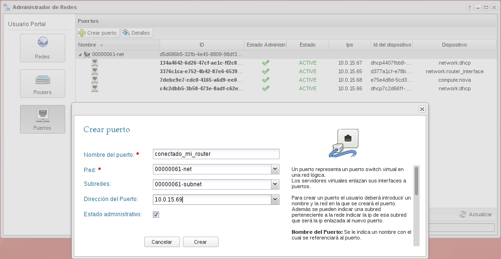
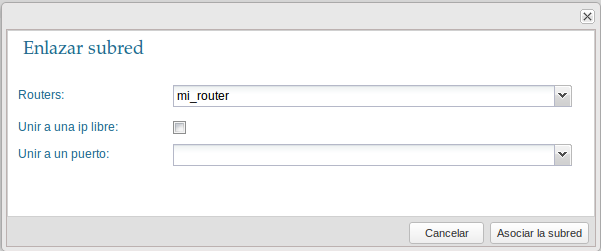
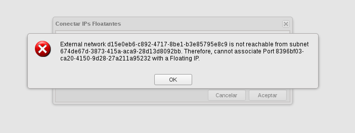

nEn esta demostración vamos a crear una nueva red, una nueva subred y un nuevo
router. El router estará conectado a las dos redes internas. El esquema de red
sería el siguiente:

Tenemos que tener en cuenta los siguientes aspectos:

* Al crear el nuevo router, no lo vamos a conectar a la red interna.
* Hay que modificar las características de la subred de la primera red
  00000061-net para que el servidor dhcp mande una ruta a las instancias
  conectadas a la red para que sean capaces de conectarse a las instancias de la
  segunda red.
* A las instancias que esten conectadas a la segunda red no se le podrán asociar
  ip flotantes, ya que el mecanismo NAT en un router no conectado a la red
  externa no se puede realizar.

### Creación de la red y el router

En el apartado **Administrador de redes** hemos creado una red nueva con un
subred con direccionamiento 192.168.0.0/24 y un nuevo router. Al crear el router
no hemos indicado la **red externa**, por lo que no estará conectada a esa
red. Por último  hemos conectado la nueva red al nuevo router. 

Utilizando *neutron* sería:

    neutron net-create mi_red
    neutron subnet-create --name mi_subred mi_red 192.168.0.0/24
    neutron router-create mi_router
    neutron router-interface-add mi_router mi_subred

### Añadir una nueva interfaz al router

Con respecto a la primera subred no basta con añadir el router sin más, ya que en
general las subredes están configuradas para tener un router como puerta de
enlace y le reservan la primera dirección IP de su rango, pero en este caso
habrá dos redes, por lo que lo hacemos de forma manual añadiendo un puerto nuevo
a la subred.

Al crear un puerto tenemos que indicar los siguientes datos:

* Nombre del puerto.
* En que red vamos y en que subred vamos a crear el puerto.
* Dirección del puerto

Con esto el puerto estará creado, pero todavía no está conectado a ningún dispositivo.

De forma equivalente, utilizando *neutron* tendríamos que ejecutar:

    neutron port-create 00000061-net --fixed-ip ip_address=10.0.15.39
    Created a new port:
    +-----------------------+-----------------------------------------------------------------------------------+
    | Field                 | Value                                                                             |
    +-----------------------+-----------------------------------------------------------------------------------+
    | admin_state_up        | True                                                                              |
    | allowed_address_pairs |                                                                                   |
    | device_id             |                                                                                   |
    | device_owner          |                                                                                   |
    | fixed_ips             | {"subnet_id": "4751dc7e-6b54-4284-ba02-6c1a44deb076", "ip_address": "10.0.15.39"} |
    | id                    | 5138b3e0-6a88-4f79-8804-01d7c50c020f                                              |
    | mac_address           | fa:16:3e:2a:92:99                                                                 |
    | name                  |                                                                                   |
    | network_id            | d5d686b5-32fb-4e45-8809-98df3ee5ef3e                                              |
    | security_groups       | 6b8e211b-51d3-482c-9865-6b6e0bb3c94b                                              |
    | status                | DOWN                                                                              |
    | tenant_id             | 44f5cb63ad34481aab5cc9c2809e4a76                                                  |
    +-----------------------+-----------------------------------------------------------------------------------+

La conexión del router (mi_router) al puerto que acabamos de crear se puede hacer desde cirrusflex desde la ventana "Enalzar subre" y la opción "Unir a un puerto".

También lo podemos hacer a través del cliente *neutron*:

    neutron router-interface-add mi_router port=5138b3e0-6a88-4f79-8804-01d7c50c020f

En la instrucción anterior hemos utilizado el id del puerto que acabamos de crear.

Si visualizamos la lista de puerto desde cirrusflex:

Podemos ver:

* Que la red que acabamos de crear tiene un puerto conectado a una interfaz del
* router (192.168.0.1)
* Que la otra red está conectada a dos routers (10.0.15.65, al router original
  del proyecto y a 10.0.15.69 a nuestro nuevo router.)

### Añadir las rutas de encaminamiento

Cómo indicabamos anteriormente, hay que modificar las características de la
subred de la primera red 00000061-net para que el servidor dhcp mande una ruta a
las instancias conectadas a la red para que sean capaces de conectarse a las
instancias de la segunda red. 

Desde cirrusflex:

Con el cliente *neutron*:

    neutron subnet-update 00000061-subnet --host_routes type=dict list=true destination=192.168.0.0/24,nexthop=10.0.15.69

### Creación de instancias en las redes

Ya podemos crear las intancias en las dos redes, y podemos comprobar que la
instancia conectada a la nueva red tiene una nueva regla de encaminamiento: 

    debian@instancia1:~$ sudo route -n
    Kernel IP routing table
    Destination     Gateway         Genmask         Flags Metric Ref    Use Iface
    0.0.0.0         10.0.15.65      0.0.0.0         UG    0      0        0 eth0
    10.0.15.64      0.0.0.0         255.255.255.192 U     0      0        0 eth0
    192.168.0.0     10.0.15.69      255.255.255.0   UG    0      0        0 eth0

Por lo tanto podemos comprobar la conectividad entre las dos instancias:

    debian@instancia1:~$ ping 192.168.0.2
    PING 192.168.0.2 (192.168.0.2) 56(84) bytes of data.
    64 bytes from 192.168.0.2: icmp_req=1 ttl=63 time=1.93 ms
    64 bytes from 192.168.0.2: icmp_req=2 ttl=63 time=0.809 ms

### Asignación de IP flotante a la segunda instancia

¿Qué sucede si intentamos asignar una ip flotante a la segunda instancia? La
segunda instancia no está conectada directamente a la red externa por un router,
por lo tanto no se pueden crear las reglas NAT necesarias en la asignación de la
IP flotante, y por tanto está operación nos devuelve un error: 

### Accediendo a la segunda instancia

La única forma de acceder a la segunda instancia es desde la primera, pero para
ello necesitamos nuestra clave privada en la primera instancia, por lo tanto
vamos a copiar nuestro fichero pem a la primera instancia: 

    scp -i mi_clave.pem mi_clave.pem debian@185.45.74.34:/home/debian

y a continuación accedemos a la primera instancia y usaremos el la clave privada
para acceder a la segunda:

    debian@instancia1:~$ chmod 400 mi_clave.pem 
    debian@instancia1:~$ ssh -i mi_clave.pem debian@192.168.0.2

y por último comprobamos que desde la segunda instancia tenemos conectividad con
la primera:

    debian@instancia2:~$ ping 10.0.15.68
    PING 10.0.15.68 (10.0.15.68) 56(84) bytes of data.
    64 bytes from 10.0.15.68: icmp_req=1 ttl=63 time=1.12 ms
    64 bytes from 10.0.15.68: icmp_req=2 ttl=63 time=0.703 ms

### Añadir reglas de encaminamiento al router

La instrucción para añadir una regla de encaminamiento al primer
router para que pueda acceder a la nueva red interna es: 

    neutron router-update mi_router --routes type=dict list=true destination=192.168.0.0/24,nexthop=10.0.15.69

### Borrar las reglas de encaminamiento

Para poder eliminar los elementos de red que hemos creado hay que
borrar manualmente antes las reglas de encaminamiento estático que se
han definido, que se hace con las instrucciones:

    neutron router-update mi_router --routes action=clear
    neutron subnet-update 00000061-subnet --host_routes action=clear

